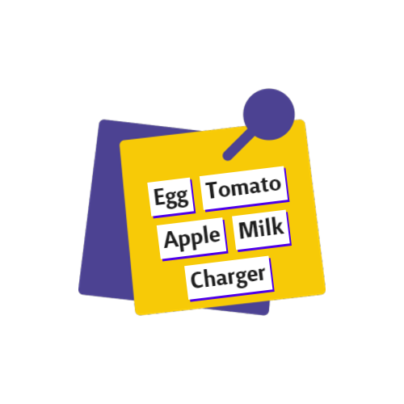
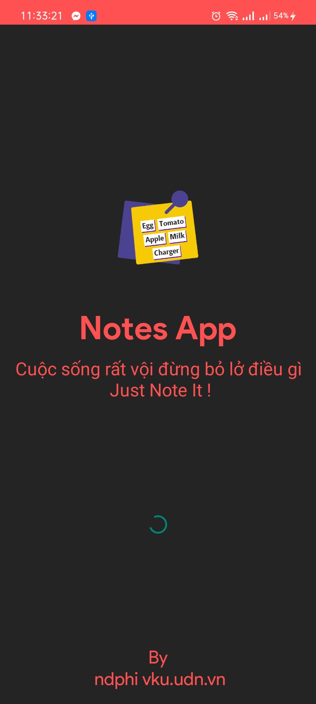
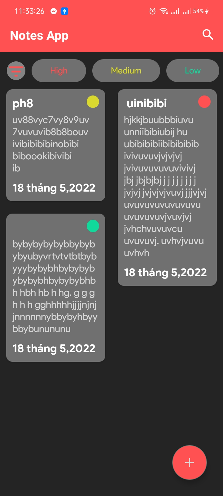
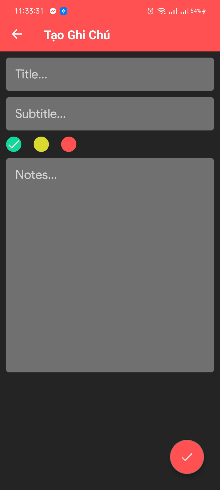
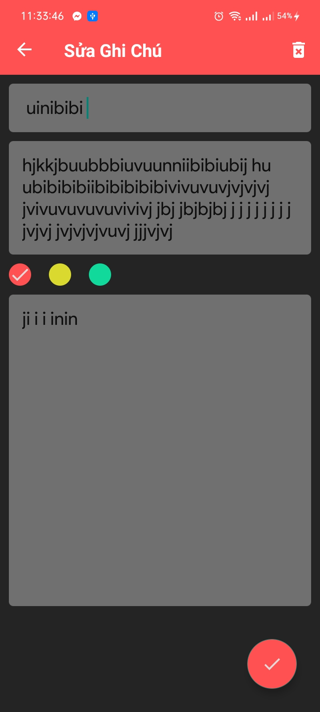
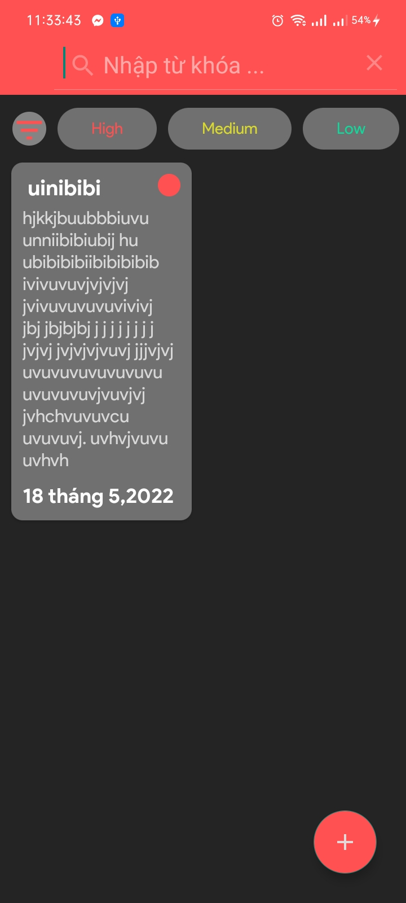
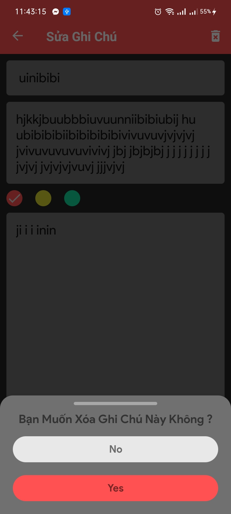

# Notes App

Notes App MVVM

Features of Notes App

-Android Architecture Components

-Kotlin View Model

-Android Architecture Patterns

-Kotlin Navigation Components

-Lifecycle

-Clean UI

-Room Database

-Live Data

-Adobe XD UI Design

-Insert, Update, Delete Operation Using Room Database

-Fast
# Screenshot 
   
   
